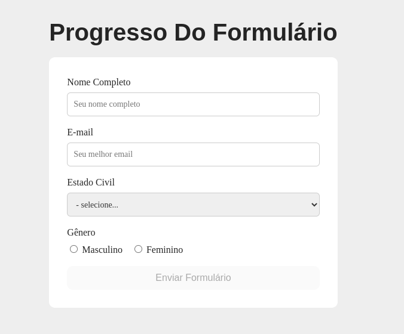
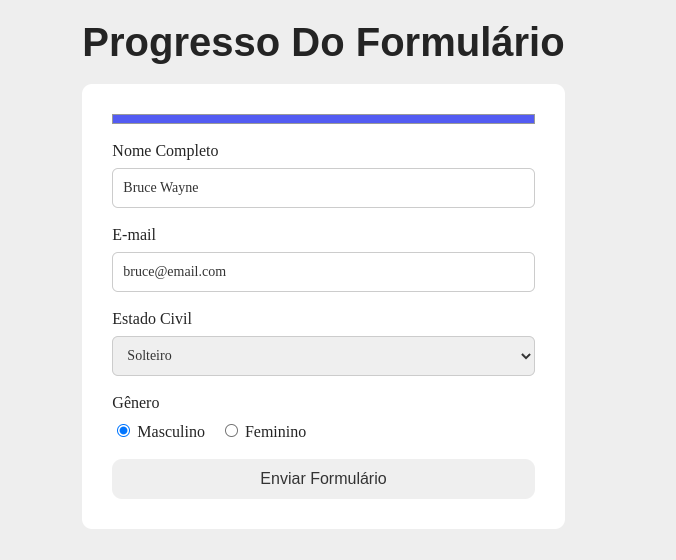

# Form Progress Bar

<p>
Exemplo de formulario com barra de progresso, assim que o usuário
preencher todos os campos o formulario fica liberado para o envio dos dados
</p>

# Screens

<p align="center">
  
  
</p>

## Technologies used

- [ReactJS](https://pt-br.reactjs.org)
- [Vite](https://vitejs.dev/)
- [Typescript](https://www.typescriptlang.org)

## Requirements

You need to install both [Node.js](https://nodejs.org) and
[Yarn](https://yarnpkg.com) or npm to run this project.

## How to use it

```bash
# Install the dependencies
$ yarn install
# Run the web server
$ yarn dev
```

The app will be available for access on your browser at (http://localhost:5173)
